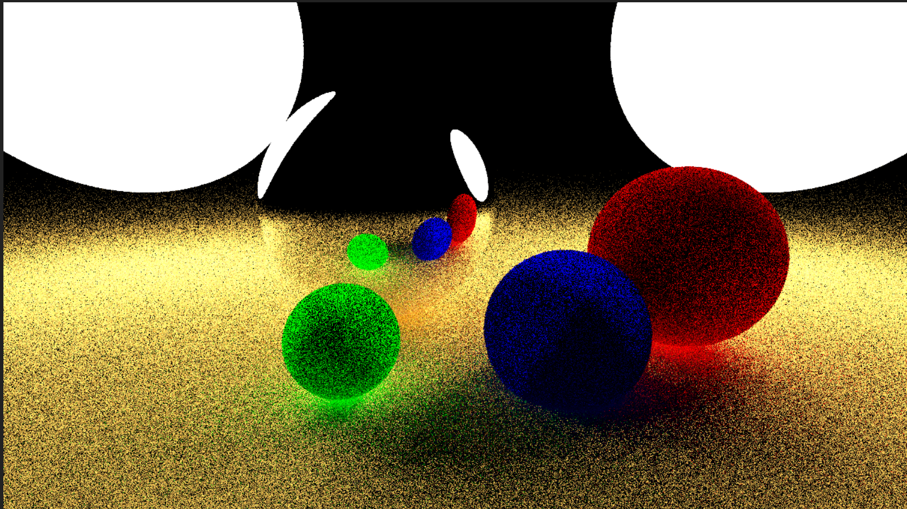
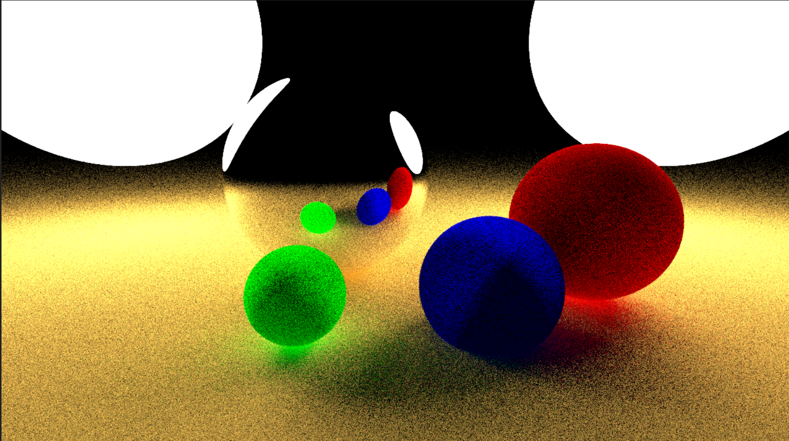
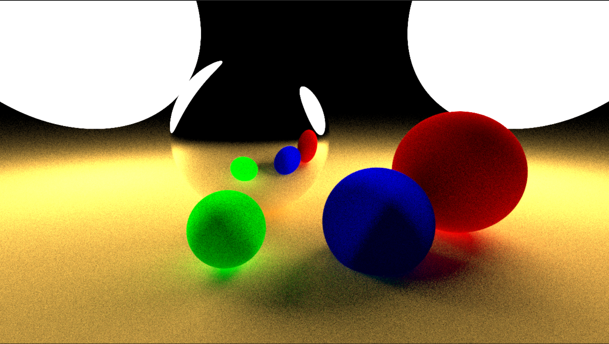
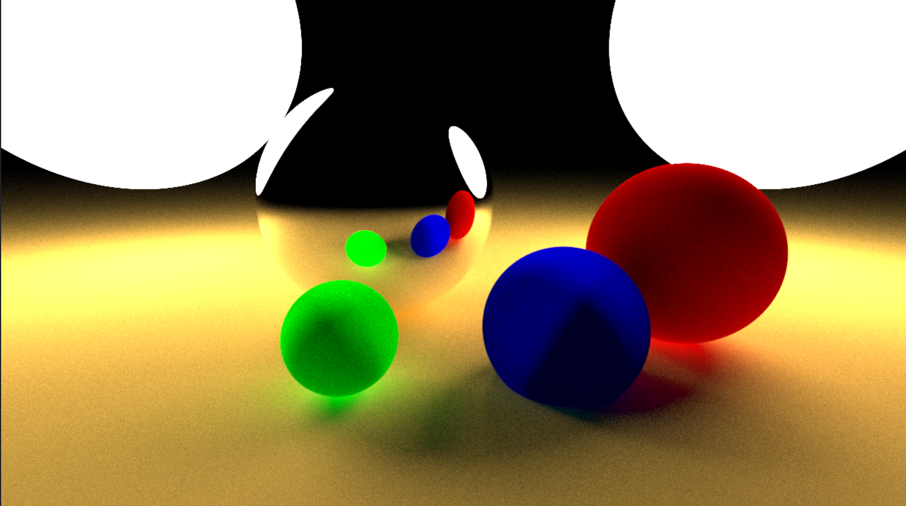

# PBR
Project On Physically Based Rendering
These images were generated with 6 bounces and samples-per-pixel 16, 64, 128, 256, 512 and 1024 respectively. These results were with no stratified sampling.

